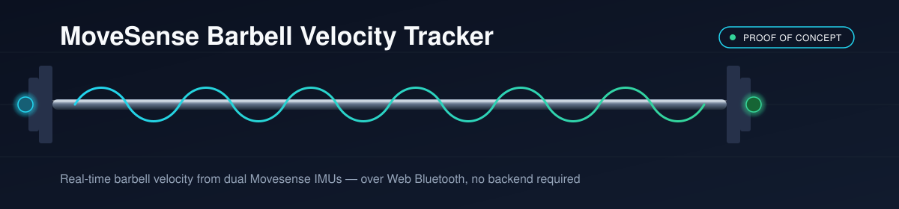
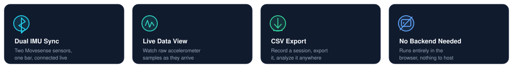
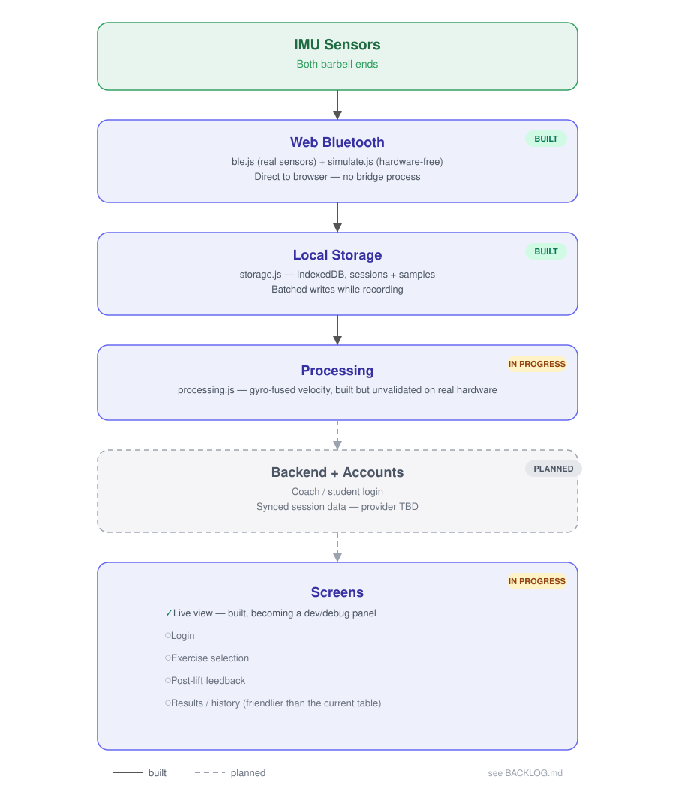

<p align="center">
  
</p>

<p align="center">
  
  
  
  
</p>

# MoveSense Barbell Velocity Tracker

Tracks barbell velocity using two Movesense IMU sensors — one on each end of the bar — over Bluetooth. Built as a project for the **KTH Sports Technology HT26** course.

<p align="center">
  
</p>

<p align="center">
  
</p>

<p align="center"></p>

## Current status: proof of concept

`UI/` is a working proof of concept for the bottom half of the architecture diagram above (`src/ble` → `src/storage`, roughly). It runs entirely in the browser:

- Connect two Movesense sensors
- Watch live IMU data
- Record a session
- Export it as CSV

No backend, no server process, nothing to keep running in the background.

> **Not built yet:** exercise selection, velocity/feedback processing, a polished results view, or accounts (login, coach/student roles).
> See [`BACKLOG.md`](BACKLOG.md) for the task breakdown.

<p align="center"></p>

## Running it

Web Bluetooth requires a secure context (`https://` or `localhost`) and only works in **Chromium browsers — Chrome or Edge** (not Safari or Firefox). Opening the HTML file directly (`file://`) will not work.

```bash
python -m http.server 8090 --directory UI
```

Then open [`http://localhost:8090`](http://localhost:8090) in Chrome or Edge.

There's also a **"Use simulated sensors"** checkbox on the page for developing or demoing without any Movesense hardware nearby — it generates fake but plausible accelerometer data through the exact same code path as real sensors.

<p align="center"></p>

## Repo layout

### `UI/` — the actual product (this is what's being developed)

| File | Purpose |
|---|---|
| `index.html` | Entry point: markup, dark-theme styling, and the `<script>` tags that wire everything together. |
| `JS/ble.js` | Real Web Bluetooth transport. Connects directly to Movesense sensors — GATT service discovery, subscribe/notify, parses raw accelerometer notifications. Handles auto-reconnect if a sensor drops. One `requestDevice()` call per sensor (a Web Bluetooth limitation — the browser can't multi-select), so there are two "Connect Left/Right Sensor" buttons rather than one. |
| `JS/simulate.js` | Fake sensor transport with the *same interface* as `ble.js` (`addSensor` / `disconnectSensor` / `setSampleHandler`), so the rest of the app can't tell the difference. Used for the "simulate sensors" checkbox. |
| `JS/storage.js` | IndexedDB layer — all local, no server. Two stores: `sessions` (one row per recording) and `samples` (one row per IMU reading, tagged by session and sensor). Also builds the CSV export string. |
| `JS/app.js` | UI state and orchestration. Funnels samples from whichever transport is active into the live view, and (while recording) into a batched write buffer flushed to `storage.js` every 500ms. Owns no BLE or IndexedDB details itself — those stay in `ble.js` / `storage.js`. |

### Legacy / reference (not used by `UI/`, kept for reference)

| File | Purpose |
|---|---|
| `movesense_breytt.html` | Original single-file Web Bluetooth prototype (jQuery + Plotly). Proved the multi-sensor connection pattern that `UI/JS/ble.js` is built on. |
| `movesense_bridge.py` | Python BLE-to-WebSocket bridge for a single sensor — an earlier architecture where a local Python process relayed sensor data to the browser. Superseded by direct Web Bluetooth (no background process needed), kept as an optional dev/debug tool. |
| `movesense_brigeMulti.py` | Same idea as above, extended to multiple sensors. Also superseded, also kept for reference. |

<p align="center"></p>

## Architecture notes for the team

- **No backend yet.** Everything currently lives in the browser (IndexedDB), scoped to one device. This is intentional for the POC phase, but it means recorded sessions don't sync across devices or users — that requires a real backend + auth, which is planned but not started (see [`BACKLOG.md`](BACKLOG.md)).
- **Data shape:** a `sample` is always `{ sensor, device, t, x, y, z }` (plus `recvAt` once persisted), regardless of whether it came from a real sensor or the simulator — anything consuming samples should rely on that shape, not on which transport produced them.
- **No build tooling on purpose** — no npm, no bundler. Keep it plain HTML/CSS/JS unless a real need for one shows up; it keeps the barrier to contributing near zero.

<p align="center">
  
</p>
